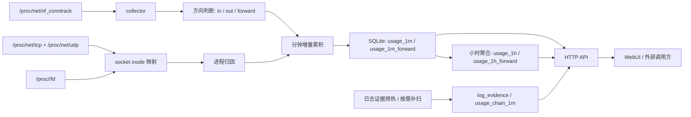

# traffic-go

`traffic-go` 是一个面向 Linux 服务器的轻量流量监控与归因工具。
它不依赖 eBPF，不抓包，不需要外置数据库；而是直接读取 `/proc/net/nf_conntrack`、`/proc/net/{tcp,udp}` 和 `/proc/[pid]/fd`，把连接增量、方向、进程归因与查询能力落到同一个 Go 二进制里。

它要解决的是一类很具体的问题：

- 某台 VPS 最近是谁在跑流量。
- 流量是入站、出站，还是 `forward` / NAT 转发。
- 某个进程在什么时间段访问了哪些对端 IP、端口和协议。
- 几小时甚至几十天后，能不能继续回查，而不是只能看实时连接。


> README 截图使用前端 mock 数据生成，避免暴露真实生产流量、域名或 IP。

## 适用场景

- CentOS 7、旧内核 VPS、不能方便上 eBPF 的环境。
- 代理机、落地机、转发机、轻量网关。
- 需要一个可落地、可部署、可回查的单机流量台账。
- 想优先回答“哪个进程在跟谁通信”，而不是做完整 NDR / IDS。

## 核心特性

- Linux-only，单个 Go 二进制运行。
- 不依赖 eBPF、Kafka、Prometheus、外置数据库。
- 以 SQLite 持久化分钟级和小时级流量。
- WebUI 与 JSON API 由同一进程提供。
- 支持按进程、PID、EXE、端口、远端 IP、方向、协议过滤。
- 单独统计 `forward` / NAT 流量，避免和普通入站、出站重复计算。
- `usage/explain` 支持日志证据关联，适合反查代理、Web 请求和链路线索。
- 前端支持纯 mock 运行，便于演示和截图，不依赖生产库。

## 原理

`traffic-go` 的设计目标不是“看到每一个包”，而是“在老机器上稳定回答流量归属问题”。
因此它采用的是 conntrack + procfs 的组合方案：



### 1. 连接采集

collector 按 `tick_interval` 周期读取 `/proc/net/nf_conntrack`，解析出每条连接的协议、源/目的 IP、端口、字节数和包数。

这里读到的是内核维护的连接跟踪状态，而不是镜像流量或 socket hook，所以它的优点是：

- 老内核可用。
- 成本低。
- 不需要在部署机上额外挂 eBPF 程序。

代价是：

- 只能看到 conntrack 能看到的连接。
- 看不到完整 payload，也不直接知道 HTTP URI、TLS SNI 或应用协议字段。

### 2. 方向判断

拿到连接后，`traffic-go` 会结合本机地址判断它是：

- `in`：远端访问本机。
- `out`：本机访问远端。
- `forward`：流量经过本机转发，但不归属到本机进程。

`forward` 会写入独立表：

- `usage_1m_forward`
- `usage_1h_forward`

这样它不会和普通入站/出站统计混在一起，也不会误算成“某个本机进程的连接”。

### 3. 进程归因

对于非 `forward` 流量，系统会尝试把连接归到进程：

1. 从 `/proc/net/tcp`、`/proc/net/udp` 拿到 socket inode。
2. 反查 `/proc/<pid>/fd`，找出哪个进程还持有这个 inode。
3. 结合 PID、进程名和 EXE 做 best-effort 归因。

这一步不是内核级强绑定，所以要明确边界：

- TCP 归因通常更稳。
- UDP 只能 best-effort，尤其是未 connect 的 UDP、DNS、QUIC、中继 relay 类流量。
- 极短连接如果在两个采集周期之间出现并消失，可能完全看不到。

### 4. 增量与基线

conntrack 暴露的是连接累计字节数，不是每分钟增量。
因此 `traffic-go` 会对每个首次观测到的连接先建立 baseline，只在之后的 tick 中计算增量。

这意味着：

- 监控启动之前已经跑了很久的连接，不会把历史累计值直接算进来。
- “启动后第一次看到它”只建基线，不记作新增流量。
- 真正持久化的是“本监控周期内的增量”。

这是为了保证分钟表语义稳定，否则服务重启一次，历史连接会把整段累积字节重新灌进数据库。

### 5. 落盘与聚合

增量先累积到当前分钟，然后写入 SQLite：

- `usage_1m`：普通入站/出站分钟明细。
- `usage_1m_forward`：转发分钟明细。
- `usage_1h`：从分钟表回放得到的小时聚合。
- `usage_1h_forward`：转发小时聚合。
- `usage_monthly`：已结束自然月的月总量摘要，供历史页面和 `/api/v1/stats/monthly` 查询。

后台任务会继续做三件事：

- 每分钟补跑小时聚合。
- 每小时检查是否有超过自然月留存窗口的数据；如果有，会先写月摘要，再清理明细。
- 每 7 天做一次 `VACUUM`。

所以查询语义是这样的：

- `active_connections` / `active_processes` 更接近运行时快照。
- `overview` / `usage` / `timeseries` 依赖分钟落盘，通常要等到下一个分钟边界后更稳定。

### 6. 日志证据与 `usage/explain`

conntrack 只能告诉你“谁连了谁”，不能直接告诉你“这是不是某条代理链、某个 URI、某个目标域名”。

所以 `traffic-go` 为 `usage/explain` 额外做了一层证据关联：

- 后台按 `process_log_dirs` 周期性预热日志，写入 `log_evidence`。
- 对近期分钟级 usage 预物化链路，写入 `usage_chain_1m`。
- 前端展开详情时优先查 SQLite。
- 如果缓存里还没有，再做一次按需文件补扫，并把结果回写缓存。

这一层不是为了把系统变成 DPI，而是为了在不抓包的前提下，尽可能把：

- Shadowsocks / FRPS / 代理日志
- Nginx access log
- 同进程同时间窗内的关联证据

拼成一条更可解释的“为什么这条流量被这样归因”的线索。

## 数据语义

### 分钟表和小时表

- 分钟数据源：`usage_1m`
- 小时数据源：`usage_1h`
- 转发分钟数据源：`usage_1m_forward`
- 转发小时数据源：`usage_1h_forward`

完整明细按 UTC 自然月保留，默认保留当前月和前两个月。前端长窗口筛选使用：

- `this_month`：本月
- `last_month`：上月
- `two_months_ago`：上上月

每次清理会先把已经结束的自然月写入 `usage_monthly`，再按留存窗口删除过期月份的分钟、小时、链路和日志证据明细。也就是说，每个月月初会先生成上个月的月结；如果此时某个月已经超出“当前月 + 前两个月”的完整明细窗口，它的明细会在月结存在后被清理。前端 `History` 页面会把保留期内月份和已归档月份放在同一张月度表里：保留期内月份可继续跳转明细，已归档月份只展示月总量、转发总量、证据数和链路数。

如果显式查询已经不在完整明细窗口内的数据，系统可能降级到小时表。一旦降级，分钟级维度就不可用了，例如：

- `pid`
- `exe`
- `attribution`
- 某些只存在于分钟明细的端口级细节

这不是 bug，而是因为小时聚合本来就不保留这类高基数维度。

### `processes` 接口的含义

`/api/v1/processes` 返回的是：

- 当前活跃进程。
- 最近历史窗口里出现过的进程建议项。

它的用途是给前端筛选框补全，不等同于“完整进程审计清单”。

### `usage/explain` 的定位

`usage/explain` 适合回答：

- 这条代理流量大概率从哪来、往哪去。
- 这条 Web 入站流量能不能关联到 host/path/bot。
- 这条分钟 usage 记录有没有缓存证据支撑。

它不保证：

- 每条代理连接都能精确恢复来源 IP 与目标 IP 的一一映射。
- 所有 UDP / relay / 混淆流量都能反推完整链路。

## 运行前提

至少需要满足这些内核条件：

- `/proc/net/nf_conntrack` 可读。
- `nf_conntrack` 模块已加载。
- `net.netfilter.nf_conntrack_acct=1` 已启用。

如果没有打开 `nf_conntrack_acct`，连接还能被看到，但 `bytes_*` / `pkts_*` 会一直是 `0`。

## 快速开始

### 本地开发

后端：

```bash
go test ./...
go run ./cmd/traffic-go -config deploy/config.example.yaml
```

前端：

```bash
npm --prefix web install
npm --prefix web run dev -- --host 127.0.0.1
```

Vite 开发服务器默认会把 `/api` 代理到 `deploy/config.example.yaml` 里的 `listen` 地址。
如果你想临时覆盖它：

```bash
TRAFFIC_GO_DEV_PROXY=http://127.0.0.1:<your-port> npm --prefix web run dev -- --host 127.0.0.1
```

如果你只想单独预览 UI，不接真实后端：

```bash
VITE_TRAFFICGO_USE_MOCK=1 npm --prefix web run dev -- --host 127.0.0.1
```

如果你在非 Linux 环境启动后端，collector 默认只读不采集，避免把假数据写进拷贝下来的生产库。
只有显式设置下面这个开关，后端才会写 mock 流量：

```yaml
mock_data: true
```

### Makefile

```bash
make test-backend
make test-frontend
make build-frontend
make sync-frontend
make build
make release-linux
make run
make dev-web
```

说明：

- `make build` 会先同步前端到 `internal/embed/dist/`，再编译当前平台二进制。
- `make release-linux` 会先跑前后端测试，再打 `linux/amd64` 发布物。
- `make release-linux` 与 `deploy/build-linux-gitbash.sh` 共用同一份 `deploy/package-release.sh`。

## 从 Windows 打 Linux 发布包

仓库内提供了面向 Windows Git Bash 的打包脚本：

```bash
bash deploy/build-linux-gitbash.sh
```

产物位置：

- `release/linux-amd64/traffic-go`
- `release/linux-amd64/config.yaml`
- `release/linux-amd64/traffic-go.service`
- `release/linux-amd64/install-centos7.sh`
- `release/traffic-go-linux-amd64.tar.gz`

当前发布逻辑只考虑 Linux 编译，不再保留额外的 Windows 可执行产物。

## 在 CentOS 7 上安装

最省事的路径是直接使用发布包里的安装脚本。默认安装位置：

- 二进制：`/usr/local/bin/traffic-go`
- 配置：`/etc/traffic-go/config.yaml`
- 数据库：`/var/lib/traffic-go/traffic.db`
- unit：`/etc/systemd/system/traffic-go.service`

```bash
mkdir -p /tmp/traffic-go-release
tar -xzf traffic-go-linux-amd64.tar.gz -C /tmp/traffic-go-release
cd /tmp/traffic-go-release
bash install-centos7.sh
```

安装脚本会自动：

- 创建 `traffic-go` 系统用户和用户组。
- 安装二进制、配置和 systemd unit。
- 把 `db_path` 改写为 `/var/lib/traffic-go/traffic.db`。
- `modprobe nf_conntrack`。
- 打开 `net.netfilter.nf_conntrack_acct=1`。
- `systemctl enable --now traffic-go`。

如果你已经把文件单独传到服务器，也可以手动指定输入文件：

```bash
cd /tmp/traffic-go-release
bash install-centos7.sh ./traffic-go ./config.yaml ./traffic-go.service
```

## Nginx 反代到子路径

同一个前端构建可以挂到任意子路径，例如：

- `/traffic/`
- `/ops/traffic/`
- `/whatever/`

如果你想挂到 `https://example.com/traffic/`，推荐配置：

```nginx
location = /traffic {
    return 301 /traffic/;
}

location /traffic/ {
    proxy_pass http://127.0.0.1:18080/;
    proxy_http_version 1.1;
    proxy_set_header Host $host;
    proxy_set_header X-Real-IP $remote_addr;
    proxy_set_header X-Forwarded-For $proxy_add_x_forwarded_for;
    proxy_set_header X-Forwarded-Proto $scheme;
    proxy_set_header X-Forwarded-Prefix /traffic;
}
```

关键点只有两个：

- `/traffic` 要先 301 到 `/traffic/`，否则相对静态资源路径会错。
- `proxy_pass` 末尾必须带 `/`，这样才会把 `/traffic/...` 正确剥成后端根路径。

## 配置

示例文件见 [deploy/config.example.yaml](deploy/config.example.yaml)。

主要配置项：

- `listen`：HTTP 监听地址，默认 `127.0.0.1:8080`
- `db_path`：SQLite 文件路径
- `tick_interval`：采集周期，默认 `2s`
- `proc_fs`：procfs 根目录，默认 `/proc`
- `conntrack_path`：conntrack 文件路径，默认 `/proc/net/nf_conntrack`
- `mock_data`：显式启用 mock collector
- `process_log_dirs`：进程日志路径映射，key 为进程名，大小写不敏感
- `shadowsocks_journal_fallback`：Shadowsocks 文件日志未命中时，是否回退到 systemd journal
- `retention.months`：完整明细保留的 UTC 自然月数量，默认 `3`，即当前月和前两个月
- `prefetch.enabled`：是否启用后台日志预热与链路预物化
- `prefetch.interval`：后台预热周期
- `prefetch.evidence_lookback`：每轮预热回看多久的日志时间窗
- `prefetch.chain_lookback`：每轮预物化回看多久的分钟级 usage
- `prefetch.scan_budget`：单个日志源每轮允许消耗的扫描时间
- `prefetch.max_scan_files`：单个日志源每轮最多扫描多少个候选文件
- `prefetch.max_scan_lines_per_file`：单个候选文件每轮最多读取多少行

补充说明：

- `process_log_dirs` 的 value 既可以是目录，也可以是 glob 文件模式，例如 `/var/log/frps/*.log`。
- `nginx_log_dir` 与 `ss_log_dir` 仍保留兼容支持；如果 `process_log_dirs` 已经显式写了对应进程键，则以 `process_log_dirs` 为准。
- 多个进程如果共用同一批日志文件，需要分别配置各自键指向同一个目录或 glob。
- 对 `shadowsocks-libev + shadowsocks-manager + simple-obfs`，推荐把 `ss-server`、`ss-manager`、`obfs-server` 都指向 `/var/log/shadowsocks`。
- 如果 rsyslog 已经把 `ss-server/ss-manager` 的 journal 镜像到 `/var/log/shadowsocks/*.log`，建议把 `shadowsocks_journal_fallback` 设为 `false`，避免重复兜底扫描。
- `flows_days` 和 `hourly_days` 仍可被旧配置文件解析，但已经不再作为留存策略生效。
- `log_level` 当前只做解析，不提供真正的 logger 级别裁剪。

## API 概览

主要接口：

- `GET /api/v1/healthz`
- `GET /api/v1/diagnostics/collector`
- `GET /api/v1/processes`
- `GET /api/v1/stats/overview`
- `GET /api/v1/stats/monthly`
- `GET /api/v1/stats/timeseries`
- `GET /api/v1/usage`
- `GET /api/v1/usage/explain`
- `GET /api/v1/top/processes`
- `GET /api/v1/top/remotes`
- `GET /api/v1/top/ports`
- `GET /api/v1/forward/usage`

常见查询方式：

- `?range=1h`
- `?range=24h`
- `?range=7d`
- `?range=this_month`
- `?range=last_month`
- `?range=two_months_ago`
- `?start=2026-04-15T00:00:00Z&end=2026-04-15T12:00:00Z`

示例：

```bash
LISTEN_ADDR=<listen-address>
```

健康检查：

```bash
curl "http://${LISTEN_ADDR}/api/v1/healthz"
```

采集器诊断：

```bash
curl "http://${LISTEN_ADDR}/api/v1/diagnostics/collector"
```

过去 1 小时总览：

```bash
curl "http://${LISTEN_ADDR}/api/v1/stats/overview?range=1h"
```

上月自然月总览：

```bash
curl "http://${LISTEN_ADDR}/api/v1/stats/overview?range=last_month"
```

所有历史自然月汇总：

```bash
curl "http://${LISTEN_ADDR}/api/v1/stats/monthly"
```

查询某个进程的分钟级历史：

```bash
curl "http://${LISTEN_ADDR}/api/v1/usage?range=6h&comm=ss-server&limit=50"
```

分析某一条 usage 记录的关联证据：

```bash
curl "http://${LISTEN_ADDR}/api/v1/usage/explain?ts=1710000000&proto=tcp&direction=out&pid=1088&comm=ss-server&exe=/usr/bin/ss-server&local_port=47920&remote_ip=198.51.100.44&remote_port=443"
```

查询 forward / NAT 流量：

```bash
curl "http://${LISTEN_ADDR}/api/v1/forward/usage?range=1h&limit=50"
```

## 已知限制

- 仅支持 Linux，目标是老内核和老发行版，不走 eBPF。
- UDP 归因是 best-effort；未 connect 的 UDP、DNS、QUIC、某些 relay 流量可能只能统计，不能准确归属到进程。
- 短连接如果在两个 tick 之间出现并消失，可能完全看不到。
- 服务启动后第一次观测到已有连接时只建立 baseline，不回补监控启动前的累计流量。
- 小时聚合不是分钟表的全字段复制；时间跨度足够大时，查询会自动失去 PID / EXE 等细粒度维度。
- `usage/explain` 更偏“可解释线索”，不是严格意义上的协议级取证。

## 安全与隐私

不要把 `traffic-go` 直接监听到公网地址。

它暴露的是本机网络元数据，包括：

- 哪个进程在通信。
- 通向哪个远端 IP。
- 使用了哪个本地端口和远端端口。
- 流量字节数、包数和方向。

建议的访问方式：

- SSH 端口转发
- 带认证的反向代理
- 仅允许内网访问

另外需要注意：

- `traffic.db` 是运行时数据库，通常包含真实生产流量元数据，不应公开分发。
- 仓库默认通过 `.gitignore` 忽略 `*.db`、`release/`、`.tools/`、`.codex/`、`.claude/` 等本地内容。
- README 和前端截图示例都应使用 mock 或保留样例，不要直接贴生产数据。

## 排障

### 1. `bytes_up` / `bytes_down` 一直为 0

先检查：

```bash
sysctl net.netfilter.nf_conntrack_acct
head -n 5 /proc/net/nf_conntrack
```

应该看到：

- `net.netfilter.nf_conntrack_acct = 1`
- 新连接行里带 `bytes=` / `packets=`

如果没有：

```bash
sysctl -w net.netfilter.nf_conntrack_acct=1
```

### 2. API 正常，但刚打完流量还是 0

这通常不是故障，而是因为：

- 首次观测先建 baseline。
- 分钟增量要跨分钟后才完整落盘。

可以这样验证：

```bash
curl -L "https://speed.cloudflare.com/__down?bytes=50000000" -o /dev/null
sleep 70
curl "http://${LISTEN_ADDR}/api/v1/stats/overview?range=1h"
```

### 3. 看不到进程，只看到连接数

先看：

```bash
curl "http://${LISTEN_ADDR}/api/v1/processes"
```

如果 `active_connections` 有值但进程列表为空，通常是：

- 这些流量是 `forward`
- UDP 无法稳定归因
- `/proc/[pid]/fd` 没有足够权限

### 4. 启动时报 `conntrack path ... unavailable`

说明 `/proc/net/nf_conntrack` 不存在或不可读。检查：

```bash
ls -l /proc/net/nf_conntrack
modprobe nf_conntrack
```

## 开发验证

后端：

```bash
go test ./...
go build ./cmd/traffic-go
```

前端：

```bash
npm --prefix web run test
npm --prefix web run build
```

重新生成内嵌前端：

```bash
make sync-frontend
```

## 仓库结构

```text
traffic-go/
├── cmd/
│   └── traffic-go/
│       └── main.go
├── deploy/
│   ├── build-linux-gitbash.sh
│   ├── package-release.sh
│   ├── config.example.yaml
│   ├── install-centos7.sh
│   └── traffic-go.service
├── internal/
│   ├── api/
│   ├── app/
│   ├── collector/
│   ├── config/
│   ├── embed/
│   ├── evidence/
│   ├── model/
│   └── store/
├── web/
│   ├── src/
│   ├── index.html
│   ├── package.json
│   ├── tsconfig.json
│   └── vite.config.ts
├── .github/
│   └── assets/
├── .gitignore
├── Makefile
├── go.mod
├── go.sum
└── README.md
```

职责划分可以简单理解为：

- `internal/collector/`：从内核和 procfs 看见流量并做方向/进程归因。
- `internal/store/`：把分钟增量、小时聚合和证据缓存写进 SQLite，并提供查询。
- `internal/api/`：把查询能力暴露成 HTTP API。
- `internal/app/`：把 collector、store、API 和后台维护任务装起来。
- `web/`：前端控制台，最终打包到 `internal/embed/dist/`。
- `deploy/`：发布、安装和 systemd 模板。
