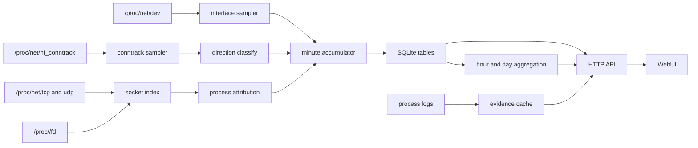

# traffic-go

`traffic-go` 是一个面向 Linux 服务器的单机流量监控和归因工具。它读取 conntrack、procfs 和配置的应用日志，按分钟记录连接增量、网卡 RX/TX、连接方向、进程、端口和对端地址。它使用同一个 Go 二进制提供采集器、SQLite 存储、JSON API 和 Web 控制台。

这个项目用于维护服务器流量台账。运维人员可以查看一台服务器在某个时间范围内产生了多少网卡接收和发送流量，也可以查看本机入站、出站和 NAT 转发连接分别由哪些进程、端口和对端地址产生。代理机、落地机、轻量网关和旧内核 VPS 都可以使用它回查流量来源。


截图使用前端 mock 数据生成。

## 设计目标

`traffic-go` 把采集、存储、聚合、查询和展示放在一个本地进程内。运行时数据写入本机 SQLite。项目不需要 eBPF、抓包程序、Prometheus、Kafka 或外置数据库。这个形态适合资源较小的 VPS，也适合只需要单机流量审计的运维场景。

系统关注连接元数据和日志证据。它记录字节数、包数、方向、协议、端口、进程和远端地址。它不会读取 payload，也不会做 DPI。`usage/explain` 会把流量明细和 nginx、Shadowsocks、FRP 等日志线索关联起来，并给出来源、目标和链路候选。这个结果用于辅助判断。

Dashboard 默认显示网卡口径。这个口径来自配置的网卡 RX/TX，适合和云服务商的流量图对比。Dashboard 也可以切换到连接方向口径。连接方向口径来自 conntrack 连接分类，适合分析本机作为客户端或服务端时的流量归属。

## 工作方式



采集器从 `/proc/net/dev` 读取网卡累计计数。`network_interfaces` 配置决定 Dashboard 网卡口径纳入哪些接口。生产环境应只填写公网网卡名，例如 `eth0`、`ens3` 或 `enp1s0`。没有配置时，系统会采集所有处于 up 状态且非 loopback 的接口。这个兼容行为可能把 Docker、VPN、隧道和 bridge 接口计入统计。

采集器从 `/proc/net/nf_conntrack` 读取连接累计字节数和包数。服务第一次看到一条连接时只建立基线，后续采集周期才计算增量。这个规则可以避免服务重启后把内核中已经累计很久的连接重新计入当前分钟。分钟数据在跨过分钟边界后会更稳定。

方向判断基于本机地址集合。远端访问本机的连接记为 `in`。本机访问远端的连接记为 `out`。经过本机转发的连接记为 `forward`。转发流量写入独立表，避免和本机进程流量混合。

进程归因基于 socket inode。TCP 连接通常更容易归属到进程。UDP、极短连接、未 connect 的 socket、代理复用和 relay 流量会降低归因稳定性。归因失败时，系统仍会保留连接统计，并用空进程字段或 `unknown` 表达边界。

## 数据保留

SQLite 中的运行表按粒度划分。`interface_1m` 保存网卡 RX/TX 分钟数据。`usage_1m` 保存普通入站和出站分钟明细。`usage_1m_forward` 保存转发分钟明细。`usage_1h`、`usage_1h_forward`、`usage_1d` 和 `usage_1d_forward` 保存聚合数据。`usage_monthly` 保存已结束自然月的摘要。`log_evidence` 保存日志证据缓存。`usage_chain_1m` 和 `usage_chain_1h` 保存物化后的归因链路。

默认保留当前 UTC 自然月和前两个月的完整明细。过期月份清理前会先写入月度摘要，然后删除分钟、小时、链路和日志证据明细。历史页面继续展示月总量、转发总量、证据数和链路数。超出完整明细窗口的查询会使用聚合表，聚合表保留的维度少于分钟表。PID、EXE 和部分端口级过滤在这些数据源上不可用。

## 运行要求

服务需要运行在 Linux 上，并且需要读取 conntrack 和 procfs。主机需要加载 `nf_conntrack` 模块。内核参数 `net.netfilter.nf_conntrack_acct` 需要设置为 `1`，这样 conntrack 行才会包含字节数和包数。systemd 模板会在启动前尝试加载模块并打开这个参数。

服务默认监听 loopback 地址。绑定到非 loopback 地址时必须配置 HTTP Basic Auth。生产环境应通过 SSH 端口转发、内网地址或带认证的反向代理访问控制台。

## 快速开始

后端可以使用示例配置运行。

```bash
go test ./...
go run ./cmd/traffic-go -config deploy/config.example.yaml
```

前端开发服务器会把 `/api` 代理到后端。

```bash
npm --prefix web install
npm --prefix web run dev -- --host 127.0.0.1
```

开发代理地址可以通过 `TRAFFIC_GO_DEV_PROXY` 覆盖。

```bash
TRAFFIC_GO_DEV_PROXY=http://127.0.0.1:18080 npm --prefix web run dev -- --host 127.0.0.1
```

前端界面可以使用 mock 数据预览。

```bash
VITE_TRAFFICGO_USE_MOCK=1 npm --prefix web run dev -- --host 127.0.0.1
```

非 Linux 环境启动后端时，collector 不写入 mock 流量。配置 `mock_data` 后才会写入演示数据。

```yaml
mock_data: true
```

## 构建和安装

常用 Make 目标覆盖后端测试、前端测试、构建、发布和本地运行。

```bash
make test-backend
make test-frontend
make build-frontend
make build
make release-linux
make run
make dev-web
```

`make build` 会先构建前端并同步到 `internal/embed/dist/`，然后编译当前平台二进制。`make release-linux` 会运行前端测试、前端构建和 Go 测试，并生成 `linux/amd64` 发布目录和压缩包。

Windows Git Bash 可以调用发布脚本。

```bash
bash deploy/build-linux-gitbash.sh
```

发布产物写入 `release/linux-amd64/`。压缩包写入 `release/traffic-go-linux-amd64.tar.gz`。

发布包包含二进制、配置示例、systemd 模板和 CentOS 7 安装脚本。安装脚本使用当前解压目录作为安装根目录。以下命令把项目安装到 `/opt/traffic-go`。

```bash
mkdir -p /opt/traffic-go
tar -xzf traffic-go-linux-amd64.tar.gz -C /opt/traffic-go
cd /opt/traffic-go
bash install-centos7.sh
```

安装脚本会创建运行账号，安装二进制和配置，改写 `db_path` 到安装目录内的 `traffic.db`，补充常见日志目录，加载 `nf_conntrack`，打开 `nf_conntrack_acct`，并启用 `traffic-go.service`。安装目录位于私有父目录下时，脚本会让服务以 root 身份运行，避免 systemd 无法进入工作目录。

已有二进制、配置和 systemd 模板可以通过参数传入。

```bash
bash install-centos7.sh ./traffic-go ./config.yaml ./traffic-go.service
```

服务状态可以用 systemd 查看。

```bash
systemctl status traffic-go.service --no-pager
journalctl -u traffic-go.service -n 100 --no-pager
```

## 配置

示例配置位于 [deploy/config.example.yaml](deploy/config.example.yaml)。配置文件使用 YAML。时间字段使用 Go duration 格式，例如 `2s`、`1m` 和 `20m`。

```yaml
listen: "127.0.0.1:18080"
db_path: ./traffic.db
tick_interval: 2s
socket_index_interval: 10s
network_interfaces:
  - eth0

process_log_dirs:
  nginx: /var/log/nginx
  ss-server: /var/log/shadowsocks
  ss-manager: /var/log/shadowsocks
  obfs-server: /var/log/shadowsocks
  frps: /root/frp_0630/*.log

shadowsocks_journal_fallback: false

retention:
  months: 3

prefetch:
  enabled: true
  interval: 1m
  evidence_lookback: 20m
  chain_lookback: 20m
  scan_budget: 8s
  max_scan_files: 6
  max_scan_lines_per_file: 250000
```

| 字段 | 含义 |
| --- | --- |
| `listen` | HTTP WebUI 和 API 的监听地址 |
| `db_path` | SQLite 数据库路径 |
| `tick_interval` | conntrack 采集周期 |
| `socket_index_interval` | procfs socket index 刷新周期 |
| `proc_fs` | procfs 根目录 |
| `conntrack_path` | conntrack 文件路径 |
| `network_interfaces` | Dashboard 网卡口径纳入的网卡名列表 |
| `mock_data` | 启用 mock collector |
| `auth.username` | Basic Auth 用户名 |
| `auth.password` | Basic Auth 密码 |
| `process_log_dirs` | 进程日志目录或 glob 文件模式 |
| `shadowsocks_journal_fallback` | Shadowsocks 文件日志未命中时读取 systemd journal |
| `retention.months` | 完整明细保留的 UTC 自然月数量 |
| `prefetch.enabled` | 启用后台日志预热和链路预物化 |
| `prefetch.interval` | 后台预热周期 |
| `prefetch.evidence_lookback` | 每轮日志预热的回看窗口 |
| `prefetch.chain_lookback` | 每轮链路预物化的 usage 回看窗口 |
| `prefetch.scan_budget` | 单个日志源每轮扫描预算 |
| `prefetch.max_scan_files` | 单个日志源每轮最多扫描文件数 |
| `prefetch.max_scan_lines_per_file` | 单个文件每轮最多读取行数 |

`network_interfaces` 用于 Dashboard 的网卡 RX/TX 口径。要和服务商流量图对齐，应只填写公网网卡。单公网口主机通常只需要一个值，例如 `eth0`、`ens3` 或 `enp1s0`。多个公网口可以写多项。未配置时，系统会采集所有 up 且非 loopback 的网卡。有 Docker、VPN、隧道或 bridge 的机器应显式配置公网口，避免虚拟网卡重复计入。

`process_log_dirs` 的 key 使用进程名或可执行文件 basename，大小写不敏感。value 可以是目录，也可以是 glob 文件模式。多个进程可以指向同一个目录。Shadowsocks 常见组合可以把 `ss-server`、`ss-manager` 和 `obfs-server` 都指向 `/var/log/shadowsocks`。FRPS 可以指向 `/var/log/frps` 或具体的 `*.log` 模式。

`shadowsocks_journal_fallback` 默认关闭。大多数安装应读取 `/var/log/shadowsocks` 下的文件日志。只有 Shadowsocks 仍然只写 systemd journal 的主机才需要打开它。

## 反向代理和日志归因

前端使用相对资源路径，可以挂载在任意子路径。以下配置把控制台挂载到 `/traffic/`。

```nginx
location = /traffic {
    return 301 /traffic/;
}

location /traffic/ {
    proxy_pass http://127.0.0.1:18080/;
    proxy_http_version 1.1;
    proxy_set_header Host $host;
    proxy_set_header X-Real-IP $remote_addr;
    proxy_set_header X-Forwarded-For $proxy_add_x_forwarded_for;
    proxy_set_header X-Forwarded-Proto $scheme;
    proxy_set_header X-Forwarded-Prefix /traffic;
}
```

`/traffic` 需要跳转到 `/traffic/`，这样静态资源相对路径可以正确解析。`proxy_pass` 末尾保留 `/`，后端收到的是剥离子路径后的请求。

`usage/explain` 可以从 nginx access log 中提取客户端、host、path、状态码、Referer 和 User-Agent。反代场景下 access log 可能只记录 `127.0.0.1`。日志格式应写入 `xff` 和 `realip` 字段。

```nginx
log_format traffic_go '$remote_addr - - [$time_local] "$request" $status $body_bytes_sent '
                      '"$http_referer" "$http_user_agent" '
                      'xff="$http_x_forwarded_for" realip="$realip_remote_addr"';

access_log /var/log/nginx/access.log traffic_go;
```

前面存在 CDN、负载均衡或本机反代时，需要配置可信代理。

```nginx
set_real_ip_from 127.0.0.1;
set_real_ip_from ::1;
# set_real_ip_from 10.0.0.0/8;
# set_real_ip_from 172.16.0.0/12;
# set_real_ip_from 192.168.0.0/16;
real_ip_header X-Forwarded-For;
real_ip_recursive on;
```

配置完成后执行 nginx 检查和 reload。

```bash
nginx -t && systemctl reload nginx
```

`process_log_dirs.nginx` 需要指向 access log 所在目录，常见路径是 `/var/log/nginx`。

## API

所有接口挂在 `/api/v1` 下。响应使用 JSON。分页接口默认返回快速估算的 `total_rows` 和 `has_more`，并把 `total_rows_exact` 置为 `false`。需要精确总数时追加 `include_total=1`。

| 接口 | 用途 |
| --- | --- |
| `GET /api/v1/healthz` | 健康检查 |
| `GET /api/v1/diagnostics/collector` | 采集器状态 |
| `GET /api/v1/diagnostics/store` | SQLite 连接池和表大小 |
| `GET /api/v1/processes` | 当前和近期进程建议项 |
| `GET /api/v1/stats/overview` | 连接方向总览统计 |
| `GET /api/v1/stats/monthly` | 自然月摘要 |
| `GET /api/v1/stats/timeseries` | 连接方向时序统计 |
| `GET /api/v1/stats/interfaces/timeseries` | 网卡 RX/TX 时序统计 |
| `GET /api/v1/usage` | 普通入站和出站明细 |
| `GET /api/v1/usage/explain` | 单条 usage 的归因解释 |
| `GET /api/v1/top/processes` | 进程排行 |
| `GET /api/v1/top/remotes` | 对端排行 |
| `GET /api/v1/top/ports` | 端口排行 |
| `GET /api/v1/forward/usage` | NAT 转发明细 |

时间范围可以使用 `range`，也可以使用 `start` 和 `end`。常用范围包括 `1h`、`24h`、`7d`、`this_month`、`last_month` 和 `two_months_ago`。显式时间使用 RFC3339。

```bash
LISTEN_ADDR=127.0.0.1:18080

curl "http://${LISTEN_ADDR}/api/v1/healthz"
curl "http://${LISTEN_ADDR}/api/v1/diagnostics/collector"
curl "http://${LISTEN_ADDR}/api/v1/diagnostics/store"
curl "http://${LISTEN_ADDR}/api/v1/stats/overview?range=1h"
curl "http://${LISTEN_ADDR}/api/v1/stats/interfaces/timeseries?range=1h"
curl "http://${LISTEN_ADDR}/api/v1/stats/monthly"
curl "http://${LISTEN_ADDR}/api/v1/usage?range=6h&comm=ss-server&limit=50"
curl "http://${LISTEN_ADDR}/api/v1/forward/usage?range=1h&limit=50"
```

`usage/explain` 需要传入前端明细行中的时间、方向、协议、进程和端口信息。

```bash
curl "http://${LISTEN_ADDR}/api/v1/usage/explain?ts=1710000000&data_source=usage_1m&proto=tcp&direction=out&pid=1088&comm=ss-server&exe=/usr/bin/ss-server&local_port=47920&remote_ip=198.51.100.44&remote_port=443"
```

默认情况下，`usage/explain` 优先读取缓存证据。追加 `scan=1` 可以触发一次按需文件扫描，扫描结果会写回缓存。小时和日聚合数据只回放已经持久化的链路和缓存证据。

## 排障

字节数一直为 0 时，应先检查 conntrack accounting。

```bash
sysctl net.netfilter.nf_conntrack_acct
head -n 5 /proc/net/nf_conntrack
```

新的 conntrack 行需要包含 `bytes=` 和 `packets=`。缺失时可以临时打开参数。

```bash
sysctl -w net.netfilter.nf_conntrack_acct=1
```

刚产生流量后总览仍为 0，通常和基线规则和分钟落盘有关。可以产生一段持续流量，等待一个完整分钟后再查总览。

```bash
curl -L "https://speed.cloudflare.com/__down?bytes=50000000" -o /dev/null
sleep 70
curl "http://${LISTEN_ADDR}/api/v1/stats/overview?range=1h"
```

进程归因为空时，应先查看当前连接和进程建议项。

```bash
curl "http://${LISTEN_ADDR}/api/v1/processes"
```

常见原因包括流量属于 NAT 转发，UDP socket 缺少稳定进程绑定，短连接在采集周期之间结束，运行用户没有足够权限读取 `/proc/[pid]/fd`。

启动时报 conntrack 文件不可用时，应检查文件和模块。

```bash
ls -l /proc/net/nf_conntrack
modprobe nf_conntrack
```

日志归因没有命中时，应确认配置中的进程名和实际 `comm` 或可执行文件 basename 一致，并确认日志目录可读。后台预热默认每分钟执行一次。刚修改日志配置后可以等待下一轮预热，或在详情接口上追加 `scan=1`。

## 限制

项目只支持 Linux。它依赖 conntrack 和 procfs 提供的信息。未进入 conntrack 的流量不会被采集。payload、TLS SNI、HTTP body 和完整应用协议字段不会被读取。UDP 归因只能尽力匹配。代理复用、混淆、relay、未 connect UDP 和极短连接会降低来源和目标的对应精度。

小时表和日表是聚合结果。长时间范围查询会减少高基数字段。`usage/explain` 的日志链路是候选证据，结果需要结合业务日志和部署拓扑判断。

## 安全和隐私

数据库包含真实流量元数据，包括进程名、可执行文件路径、远端 IP、端口、方向、字节数、包数和部分日志证据。生产环境的 `traffic.db` 不应公开分发。控制台和 API 不应直接暴露到公网。仓库通过 `.gitignore` 忽略本地数据库、发布产物、工具目录和代理运行目录。

README、测试和截图应使用 mock 或保留样例。提交问题和日志时需要清理真实 IP、域名、路径和用户标识。

## 开发验证

后端验证使用 Go 工具链。

```bash
go test ./...
go vet ./...
go build ./cmd/traffic-go
```

前端验证使用 npm。

```bash
npm --prefix web run test
npm --prefix web run build
```

重新生成内嵌前端资源使用 Make。

```bash
make sync-frontend
```

## 仓库结构

```text
traffic-go/
├── cmd/traffic-go/
├── deploy/
├── internal/api/
├── internal/app/
├── internal/collector/
├── internal/config/
├── internal/embed/
├── internal/evidence/
├── internal/model/
├── internal/store/
├── web/
├── Makefile
├── go.mod
└── README.md
```

`internal/collector` 负责内核和 procfs 采集。`internal/store` 负责 SQLite schema、写入、聚合、清理和查询。`internal/api` 负责 HTTP API、静态资源服务、日志证据扫描和归因解释。`internal/app` 负责组装 collector、store、API 和后台维护任务。`web` 是 React 控制台。`deploy` 保存发布、安装和 systemd 模板。
